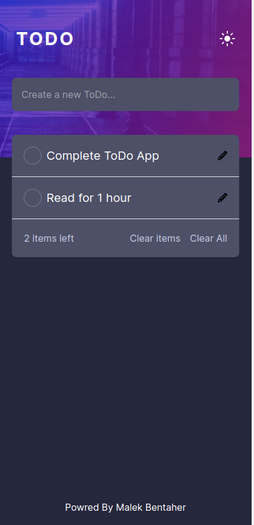
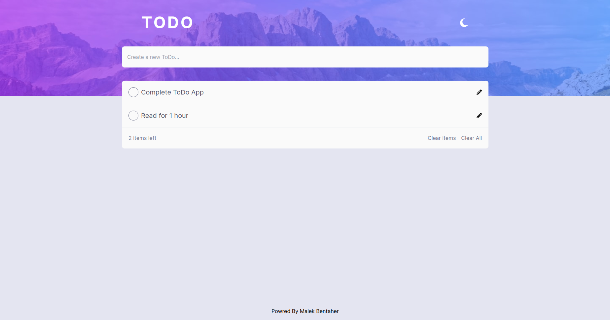
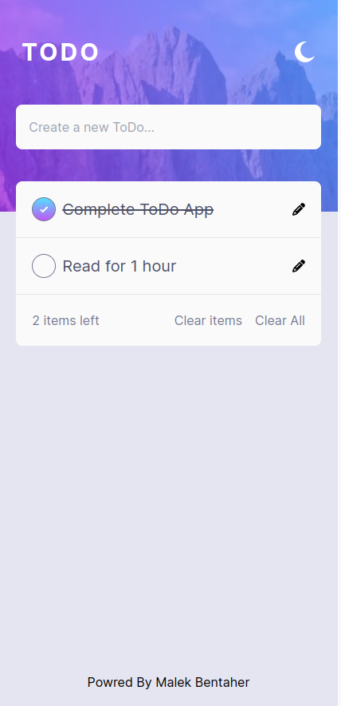
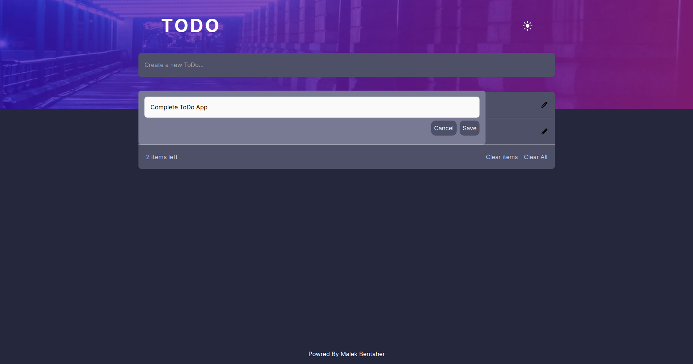
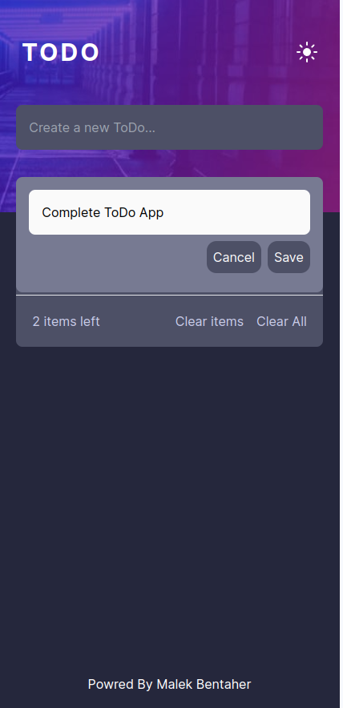
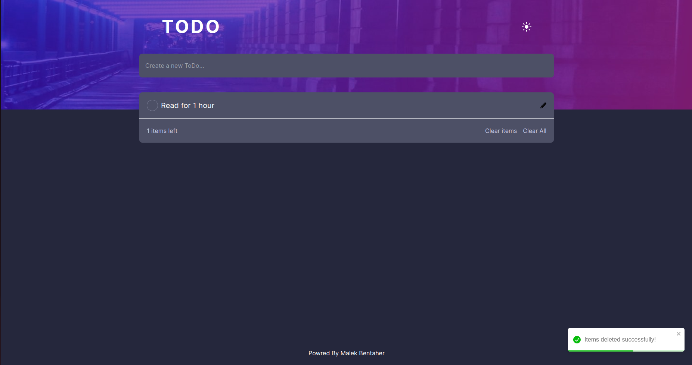

# Todo App Front

This project is a simple Todo App built with Next.js and styled with Tailwind CSS. It provides a basic structure for managing and displaying tasks.

## Getting Started

These instructions will help you set up and run the project on your local machine.

### Prerequisites

Make sure you have Node.js and npm installed on your machine.

- Node.js: [Download and Install Node.js](https://nodejs.org/)
- npm: [Install npm](https://www.npmjs.com/get-npm)

### Installation

1. Clone the repository:

   ```bash
   git clone https://github.com/malek-bt/ToDo_app_front.git
   ```

2. Navigate to the project directory:

   ```bash
   cd ToDo_app_front
   ```

3. Install dependencies:

   ```bash
   npm install
   ```

### Running the App

Run the development server:

```bash
npm run dev
```

Open [http://localhost:3000](http://localhost:3000) in your browser to view the app.

### Building for Production

To build the application for production, run:

```bash
npm run build
```

## Connecting to the Backend (Django)

This frontend is designed to work with a backend Django project. Follow these steps to integrate it with the backend:


To set up the backend for this project, follow these steps:

1. Navigate to the backend project directory:

    ```bash
    https://github.com/malek-bt/ToDo_app_back
    ```


2. Check for a `README.md` file:

    ```bash
    ls README.md
    ```

    
3. Open the README file and follow the provided instructions for setting up the backend environment, installing dependencies, and configuring any necessary settings.


## Technologies Used

- [Next.js](https://nextjs.org/) - React framework for building web applications.
- [Tailwind CSS](https://tailwindcss.com/) - A utility-first CSS framework for rapidly building custom designs.


## Screenshots

### Home Dark mode

|  |  |
| ------------------------------ | ----------------------------- |
| Desktop version                | Mobile version                |

### Home Light mode

|  |  |
| ------------------------------ | ----------------------------- |
| Desktop version                | Mobile version                |

### Edit Item

|  |  |
| ------------------------------ | ----------------------------- |
| Desktop version                | Mobile version                |

### Select Item & Show Toasts

|  |  |
| ------------------------------ | ----------------------------- |
| Desktop version                | Mobile version                |


