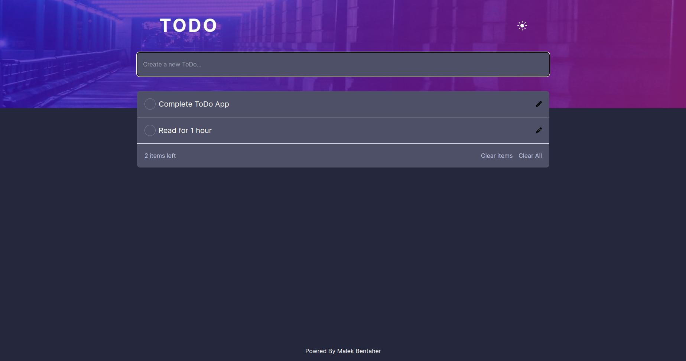

# Todo App Front

This project is a simple Todo App built with Next.js and styled with Tailwind CSS. It provides a basic structure for managing and displaying tasks.

## Getting Started

These instructions will help you set up and run the project on your local machine.

### Prerequisites

Make sure you have Node.js and npm installed on your machine.

- Node.js: [Download and Install Node.js](https://nodejs.org/)
- npm: [Install npm](https://www.npmjs.com/get-npm)

### Installation

1. Clone the repository:

   ```bash
   git clone https://github.com/malek-bt/ToDo_app_front.git
   ```

2. Navigate to the project directory:

   ```bash
   cd ToDo_app_front
   ```

3. Install dependencies:

   ```bash
   npm install
   ```

### Running the App

Run the development server:

```bash
npm run dev
```

Open [http://localhost:3000](http://localhost:3000) in your browser to view the app.

### Building for Production

To build the application for production, run:

```bash
npm run build
```


## Technologies Used

- [Next.js](https://nextjs.org/) - React framework for building web applications.
- [Tailwind CSS](https://tailwindcss.com/) - A utility-first CSS framework for rapidly building custom designs.


## Acknowledgments

- [Next.js Documentation](https://nextjs.org/docs)
- [Tailwind CSS Documentation](https://tailwindcss.com/docs)


## Invoices Dashboard

I completed a Next.js app course, mastering the key features of Next.js and building a full-stack web application. This course equipped me with the skills to develop scalable and performant web solutions using Next.js.


## Overview

Here's an overview of the features I learned about in this course:

- **Styling**: The different ways to style your application in Next.js.
- **Optimizations**: How to optimize images, links, and fonts.
- **Routing**: How to create nested layouts and pages using file-system routing.
- **Data Fetching**: How to set up a database on Vercel, and best practices for fetching and streaming.
- **Search and Pagination**: How to implement search and pagination using URL Search Params.
- **Mutating Data**: How to mutate data using React Server Actions, and revalidate the Next.js cache.
- **Error Handling**: How to handle general and 404 not found errors.
- **Form Validation and Accessibility**: How to do server-side form validation and tips for improving accessibility.
- **Authentication**: How to add authentication to your application using NextAuth.js and Middleware.
- **Metadata**: How to add metadata and prepare your application for social sharing.


## Built With

This project was built using these technologies:

- NextJS 
- TypeScript
- TailwindCSS
- Postgresql
- Vercel

## 🛠 Installation and Setup Instructions

1. Installation: `npm i`

2. In the project directory, you can run: `npm run dev`

Runs the app in the development mode.\
Open [http://localhost:3000](http://localhost:3000) to view it in the browser.
The page will reload if you make edits.

## Login

You should be able to log in and out of your application using the following credentials:

- **Email**: user@nextmail.com
- **Password**: 123456

## Navigation

This dashboard include:

- A public home page.
- A login page.
- Dashboard pages that are protected by authentication.
- The ability for users to add, edit, and delete invoices.


## Demo

Check out the live demo of my portfolio at https://nextjs14-dashboard-three-nu.vercel.app/

## Screenshots

### Home Dark mode

|  |  |
| ------------------------------ | ----------------------------- |
| Desktop version                | Mobile version                |

### Home Light mode

|  |  |
| ------------------------------ | ----------------------------- |
| Desktop version                | Mobile version                |

### Edit Item

|  |  |
| ------------------------------ | ----------------------------- |
| Desktop version                | Mobile version                |

### Select Item & Show Toasts

|  |  |
| ------------------------------ | ----------------------------- |
| Desktop version                | Mobile version                |

            


